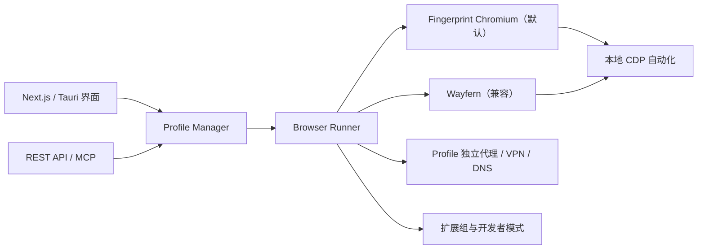

# Donut Browser 本地化改造总结

> 记录日期：2026-08-24  
> 基线：`f95e633`（Donut Browser `v0.28.1`）  
> 目标：保留 Wayfern 兼容能力，同时引入默认开源指纹浏览器后端，并完善本地 MCP、扩展和开发环境。

## 1. 改造概览

本次改造将 Donut Browser 从仅使用 Wayfern 的单浏览器结构，调整为双后端结构：

- `fingerprint_chromium`：新建 Profile 的默认后端，使用开源 Fingerprint Chromium 构建。
- `wayfern`：继续作为可选后端，兼容已有 Profile 和原有能力。
- Donut 仍负责 Profile、代理、VPN、DNS、扩展、Cookie、进程和 MCP 的统一管理。
- 本地开发构建可通过编译 feature 启用已授权的自托管浏览器自动化，不依赖托管套餐的自动化 entitlement。



## 2. Fingerprint Chromium 双后端

### 2.1 后端模型

新增 `src-tauri/src/fingerprint_chromium.rs`，定义浏览器标识、固定版本和 Profile 指纹配置。配置包含：

- 基于 Profile UUID 生成的稳定非零 seed。
- 平台、品牌、硬件并发数、时区和语言。
- WebRTC 非代理 UDP 限制。
- 图片、WebGL 和部分 spoofing 开关。
- GeoIP 结果及其对应的代理签名。

`BrowserType`、浏览器工厂、版本管理、下载器、Profile 数据结构和运行状态检查均已支持 `fingerprint_chromium` 与 `wayfern`。

### 2.2 默认浏览器与下载

- REST API、MCP 和创建 Profile 界面均默认使用 `fingerprint_chromium`。
- 当前固定版本为 `144.0.7559.132`。
- 当前支持 Windows x64 和 Linux x64。
- 下载地址来自 `adryfish/fingerprint-chromium` GitHub Release。
- 下载完成后校验平台对应的 SHA-256；校验失败会删除归档和注册记录，并返回错误。
- 应用启动时默认确保 Fingerprint Chromium 已下载，不再默认下载 Wayfern。
- Wayfern 条款检查仅在实际下载 Wayfern 时触发。

### 2.3 启动链路

Fingerprint Chromium 启动时会：

1. 解析 Profile 的独立代理或 VPN。
2. 启动本地 SOCKS5 代理工作进程，并应用 bypass 和 DNS blocklist。
3. 在代理出口变化时刷新时区、语言等 GeoIP 配置。
4. 准备持久、密码保护或临时 Profile 数据目录。
5. 安装 Profile 所属扩展组中的扩展。
6. 启动浏览器并分配或复用指定 CDP 端口。
7. 等待 CDP 就绪后登记进程、端口和运行状态。

两个 Chromium 后端共用 Donut 的本地 CDP 实例注册表，因此打开 URL、状态检查、停止进程和 MCP 网页控制走同一套管理链路。

## 3. Wayfern Profile 迁移

新增 Wayfern 到 Fingerprint Chromium 的迁移能力：

- 仅允许迁移已停止的 Wayfern Profile。
- 保留 Profile 名称、ID、代理、VPN、扩展组、标签、备注和密码保护状态。
- 将可兼容的 OS、GeoIP、语言、时区、硬件并发数和屏蔽选项转换为新配置。
- Profile 浏览器版本切换为固定的 Fingerprint Chromium 版本。
- 密码保护 Profile 会先解锁，迁移完成后重新加密。

浏览器数据迁移会备份原 Wayfern `Default` 目录，并选择性保留：

- Bookmarks、History、Favicons。
- Cookies 所在的 Network 数据。
- Login Data、Web Data。
- IndexedDB、Local Storage、Service Worker、WebStorage。
- 扩展的 Local/Sync Extension Settings。

不会复制版本敏感的 Preferences、缓存和代码缓存。迁移标记确保该操作幂等，避免重复覆盖。

MCP 新增：

```text
migrate_profile_to_fingerprint_chromium
```

## 4. 扩展与开发者模式

当 Profile 已分配扩展组并成功准备出本地扩展目录时，启动链路会自动启用 Chromium 扩展开发者模式。

Windows 实现会更新 Profile 的 `Default/Secure Preferences`：

- 写入 `extensions.ui.developer_mode = true`。
- 同步写入对应的 preference MAC。
- 保留文件内已有的其他扩展配置和 protection 字段。
- 当值和 MAC 已正确时不重复写文件。

该行为同时覆盖 Wayfern 和 Fingerprint Chromium。非 Windows 平台当前只记录不支持持久化开发者模式的警告，不阻止浏览器启动。

扩展组安装、Cookie 读取/导入/复制能力也已扩展到两个 Chromium 后端。

ChatGPT 插件仍有一项 Chromium 限制：固定工具栏图标不等于打开侧边栏。`chrome.sidePanel.open()` 需要用户操作，因此每个新 Profile 首次建立插件连接时仍需点击图标或按 `Ctrl+Shift+.`。

## 5. MCP 与本地自动化

MCP 已支持两个 Chromium 后端，并新增：

- `unlock_profile`：在当前 Donut 会话中解锁密码保护的 Profile。
- `migrate_profile_to_fingerprint_chromium`：迁移后端及浏览器数据。
- 创建 Profile 时省略 `browser` 会默认选择 Fingerprint Chromium。
- CDP 端口查询使用 Profile 的实际有效目录，兼容临时 Profile。
- Profile 启停、批量启动、页面读取、截图、脚本执行、点击和输入均可作用于两个后端。

新增 Cargo feature：

```text
self-hosted-browser-automation
```

该 feature 仅让本地 API/MCP 浏览器自动化通过 entitlement 检查，不改变云同步、云代理、Wayfern token 和其他托管能力的权限逻辑。

## 6. 前端适配

- 创建 Profile 默认选择“指纹 Chromium”，同时保留 Wayfern 下拉选项。
- 创建、详情和指纹配置界面复用公共配置表单。
- Fingerprint Chromium 可免费编辑其当前支持的有限配置；Wayfern 原有付费/跨 OS 判断保持不变。
- Profile 表格、图标、跨 OS 判断、窗口尺寸提醒和 Cookie 操作均识别新后端。
- 新增文案已同步到九种语言文件。

## 7. 本地开发环境

`pnpm tauri dev` 的命令包装器会自动补充：

```text
--no-watch --features self-hosted-browser-automation
```

因此正常本地开发直接运行：

```powershell
pnpm tauri dev
```

前端开发服务器由 Turbopack 切换为 Webpack，以规避本地开发期间观察到的 Next.js/Turbopack 错误。

开发数据与生产数据继续隔离：

```text
开发：%LOCALAPPDATA%\DonutBrowserDev
生产：%LOCALAPPDATA%\DonutBrowser
```

## 8. 文档沉淀

- `docs/local-development.md`：本地安装、启动、停止、数据目录和打包。
- `docs/donut-mcp-chatgpt-extension-skill.md`：MCP、Profile、ChatGPT 插件连接和故障排查。
- `启动命令.md`：Donut、donut-sync、MinIO、MCP、Mihomo 和代理测试命令总表。
- `docs/20260824.md`：本次整体改造记录和提交边界。

## 9. 测试覆盖

本次新增或扩展的单元测试覆盖：

- Profile seed 稳定性及指纹启动参数。
- Wayfern 用户数据迁移的保留范围和幂等性。
- Fingerprint Chromium 平台、版本和下载地址。
- 下载归档 SHA-256 成功及失败路径。
- 扩展开发者模式 preference MAC、字段保留和幂等写入。
- MCP 双浏览器识别、新工具注册和默认浏览器。
- 各处 `BrowserProfile` 测试对象对新字段的兼容。

提交前执行：

```powershell
pnpm format
pnpm lint
pnpm test
```

### 9.1 本轮实际验证结果

2026-08-23 在 Windows、Rust `1.95.0` 环境中得到以下结果：

| 检查项 | 结果 |
| --- | --- |
| Biome、TypeScript、donut-sync 静态检查 | 通过 |
| `cargo fmt --all -- --check` | 通过 |
| Rust lib/bin/tests clippy（all features） | 通过 |
| Rust 库测试 | `305 passed, 0 failed` |
| donut-proxy 集成测试 | `14 passed, 0 failed` |
| VPN 集成测试 | `15 passed, 0 failed` |
| 同步端到端测试 | `15 passed, 0 failed` |

测试时保留了当前运行中的 Donut，因此使用系统临时 `CARGO_TARGET_DIR`。Rust `1.95.0` 在默认测试调试信息级别下生成的 `libdonutbrowser_lib.rlib` 约为 `4.59 GB`，超过 Windows MSVC 链接器可处理的库格式；集成测试通过以下环境设置完成：

```powershell
$env:CARGO_TARGET_DIR = Join-Path $env:TEMP "donutbrowser-codex-test-nodebug-20260823"
$env:CARGO_INCREMENTAL = "0"
$env:CARGO_PROFILE_TEST_DEBUG = "0"
```

完整 `pnpm lint` 仍有两个环境性例外：

- `typos` 命令未安装，因此拼写检查未执行。
- `--all-targets` 会检查未纳入提交的 `src-tauri/examples/mcp_profile_recover.rs`；该一次性本地示例使用了过期 AES API，无法通过 clippy。正式的 lib、bin 和 tests 目标已单独通过 clippy。

## 10. 分批提交方案

### 批次 1：浏览器后端与 MCP

建议提交信息：

```text
feat(browser): add fingerprint chromium backend
```

范围：Rust 双后端、固定版本下载与校验、启动链路、Profile 迁移、扩展开发者模式、Cookie 兼容、REST API 和 MCP。

### 批次 2：前端双后端适配

建议提交信息：

```text
feat(ui): make fingerprint chromium the default backend
```

范围：创建 Profile、详情页、指纹配置、表格、浏览器显示工具、类型定义及九种语言。

### 批次 3：自托管开发启动

建议提交信息：

```text
build(dev): enable self-hosted automation by default
```

范围：Cargo feature、自动化 entitlement、本地 Tauri 默认参数和 Next.js Webpack 开发模式。

### 批次 4：文档

建议提交信息：

```text
docs: document local browser automation workflow
```

范围：开发指南、MCP/ChatGPT 插件指南、启动命令、仓库结构和本改造总结。

## 11. 不进入提交的本地文件

以下文件属于本机运行产物或一次性诊断工具，不纳入上述提交：

- `.codex-tauri-dev-*.log`
- `.codex-tauri-dev-default.*.log`
- `src-tauri/examples/mcp_profile_recover.rs`

`mcp_profile_recover.rs` 包含固定的本地数据目录、测试密码和一次性 Profile 操作，不适合作为通用项目示例。若后续需要保留，应先改造成从环境变量读取数据的通用工具。

## 12. 已知边界

- Fingerprint Chromium 当前固定单一版本，升级时需要同时更新版本号、下载文件名和 SHA-256。
- 当前只提供 Windows x64、Linux x64 下载；macOS 尚未配置发布归档。
- Wayfern 到 Fingerprint Chromium 的数据迁移是选择性迁移，不复制版本敏感设置。
- 扩展开发者模式的自动持久化当前只在 Windows 实现。
- ChatGPT 侧边栏首次打开仍受 Chromium 用户手势限制。
- 代理隔离依赖每个 Profile 绑定独立固定上游端口；多个 Profile 复用同一端口不会产生独立出口。
