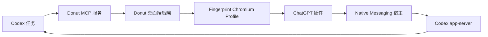

# Donut MCP 与 ChatGPT 插件操作指南

本文档说明如何：

1. 连接本地 Donut MCP 服务。
2. 解锁并启动一个或多个浏览器 Profile。
3. 让 Codex 连接到指定 Profile 中的 ChatGPT 插件。
4. 通过 ChatGPT 插件读取网页并执行交互。
5. 排查常见的插件连接和 WebSocket 故障。

## 整体架构



Donut MCP 和 ChatGPT 插件承担不同职责：

- Donut MCP 负责管理 Profile、代理、VPN、扩展和浏览器进程。
- ChatGPT 插件负责把正在运行的 Chromium 实例连接到 Codex。
- Donut MCP 也可以直接自动化网页，但它使用的是另一条基于 CDP 的链路。
  不要把 MCP 读取到的网页内容描述成由 ChatGPT 插件提供。

## 前置条件

启动已授权的本地自动化开发版本：

```powershell
cd C:\code\donutbrowser
pnpm tauri dev
```

Profile 需要满足以下条件：

- 浏览器后端使用 `fingerprint_chromium` 或其他兼容的 Chromium 构建。
- Profile 已分配包含 ChatGPT 插件的扩展组。
- ChatGPT 插件 ID 为 `hehggadaopoacecdllhhajmbjkdcmajg`。
- Native Messaging 清单位于：
  `%LOCALAPPDATA%\OpenAI\extension\com.openai.codexextension.json`.
- Windows 中已存在 Chromium Native Messaging 注册表项：
  `HKCU\Software\Chromium\NativeMessagingHosts\com.openai.codexextension`.

不要提交完整的 MCP URL，因为 URL 路径中包含本地访问令牌。应通过环境变量传入：

```powershell
$env:DONUT_MCP_URL = "http://127.0.0.1:51080/mcp/<LOCAL_TOKEN>"
```

## MCP 功能概览

主要 MCP 工具如下：

| 功能领域 | 常用工具 |
| --- | --- |
| Profile 管理 | `list_profiles`, `get_profile`, `create_profile`, `update_profile`, `delete_profile` |
| 进程控制 | `unlock_profile`, `run_profile`, `kill_profile`, `batch_run_profiles`, `batch_stop_profiles`, `get_profile_status` |
| 网页自动化 | `navigate`, `get_page_info`, `get_page_content`, `screenshot`, `evaluate_javascript`, `click_element`, `type_text` |
| 代理与 DNS | `list_proxies`, `create_proxy`, `update_profile_proxy_bypass_rules`, `update_profile_dns_blocklist` |
| VPN | `list_vpn_configs`, `connect_vpn`, `disconnect_vpn`, `get_vpn_status` |
| 扩展管理 | `list_extensions`, `list_extension_groups`, `assign_extension_group_to_profile` |
| 数据管理 | `import_profile_cookies`、同步会话相关工具 |

浏览器启动与自动化工具需要本地浏览器自动化权限。在社区开发版本中，通过
`self-hosted-browser-automation` feature 启用。

## 连接 MCP

MCP 使用基于 HTTP 的 JSON-RPC 协议。首先执行初始化，并保留响应头中的
`Mcp-Session-Id`：

```powershell
$McpUrl = $env:DONUT_MCP_URL
$Headers = @{
  "Content-Type" = "application/json"
  "Accept" = "application/json, text/event-stream"
}

$Initialize = @{
  jsonrpc = "2.0"
  id = 1
  method = "initialize"
  params = @{
    protocolVersion = "2025-03-26"
    capabilities = @{}
    clientInfo = @{
      name = "donut-local-client"
      version = "1.0"
    }
  }
} | ConvertTo-Json -Depth 10

$Response = Invoke-WebRequest `
  -Uri $McpUrl `
  -Method Post `
  -Headers $Headers `
  -Body $Initialize

$SessionHeaders = $Headers.Clone()
$SessionId = $Response.Headers["Mcp-Session-Id"]
if ($SessionId) {
  $SessionHeaders["Mcp-Session-Id"] = $SessionId
}

function Invoke-DonutMcp {
  param(
    [int]$Id,
    [string]$Tool,
    [hashtable]$Arguments
  )

  $Body = @{
    jsonrpc = "2.0"
    id = $Id
    method = "tools/call"
    params = @{
      name = $Tool
      arguments = $Arguments
    }
  } | ConvertTo-Json -Depth 12

  $Result = Invoke-WebRequest `
    -Uri $McpUrl `
    -Method Post `
    -Headers $SessionHeaders `
    -Body $Body

  return $Result.Content | ConvertFrom-Json
}
```

## 打开一个 Profile

受密码保护的 Profile 必须先在当前 Donut 应用会话中解锁，然后才能启动：

```powershell
$ProfileId = "<PROFILE_UUID>"
$Password = $env:DONUT_PROFILE_PASSWORD

Invoke-DonutMcp 10 "unlock_profile" @{
  profile_id = $ProfileId
  password = $Password
}

Invoke-DonutMcp 11 "run_profile" @{
  profile_id = $ProfileId
  url = "https://www.baidu.com"
  headless = $false
}
```

检查 Profile 运行状态：

```powershell
Invoke-DonutMcp 12 "get_profile_status" @{
  profile_id = $ProfileId
}
```

## 批量打开 Profile

不要重复启动已经存在进程 ID 的 Profile。先解锁所有选中的 Profile，再把仍处于
停止状态的 Profile ID 传给 `batch_run_profiles`。

```powershell
$ListResult = Invoke-DonutMcp 20 "list_profiles" @{}
$Profiles = $ListResult.result.content[0].text | ConvertFrom-Json
$Selected = @($Profiles | Where-Object { $_.name -like "xhs*" })

$RequestId = 30
foreach ($Profile in $Selected) {
  Invoke-DonutMcp $RequestId "unlock_profile" @{
    profile_id = $Profile.id
    password = $env:DONUT_PROFILE_PASSWORD
  }
  $RequestId++
}

$StoppedIds = @(
  $Selected |
    Where-Object { $null -eq $_.process_id } |
    Select-Object -ExpandProperty id
)

if ($StoppedIds.Count -gt 0) {
  Invoke-DonutMcp 100 "batch_run_profiles" @{
    profile_ids = $StoppedIds
    headless = $false
  }
}
```

## 连接 ChatGPT 插件

### 准备 Codex 浏览器运行环境

通过 Codex 的 `node_repl` `js` 工具执行浏览器控制 JavaScript。如果运行环境已经
初始化，应直接复用：

```javascript
if (globalThis.agent?.browsers == null) {
  globalThis.donutBrowserClient = await import(
    "<CODEX_CHROME_PLUGIN_ROOT>/scripts/browser-client.mjs",
  );
  await donutBrowserClient.setupBrowserRuntime({ globals: globalThis });
}
```

`<CODEX_CHROME_PLUGIN_ROOT>` 是已安装的 Chrome 插件目录，其中应包含
`scripts/browser-client.mjs`。不要在同一个 JavaScript 会话中重复初始化运行环境。

### 必须执行一次用户操作

Codex 要控制哪个 Profile，就必须先在该 Profile 中打开 ChatGPT 插件侧边栏。

可以使用以下任一方式：

- 点击工具栏中已固定的 ChatGPT 插件图标。
- 按下 `Ctrl+Shift+.`。

Chrome 要求 `chrome.sidePanel.open()` 必须由用户操作触发，因此新 Profile 启动时
无法可靠地自动打开侧边栏。

固定插件图标和打开侧边栏是两种不同状态：

- `extensions.pinned_extensions` 只控制工具栏图标是否固定。
- 打开侧边栏才会建立 Codex 浏览器控制连接。

### 选择正确的插件实例

每个 Donut Profile 都是独立的 Chromium 实例。当普通 Chrome 和多个 Donut
Profile 同时打开时，Codex 会发现多个 `type: "extension"` 的实例。

不要直接使用：

```javascript
await agent.browsers.get("extension")
```

它会返回首个首选插件实例，可能错误地选中普通 Chrome。

应先列出所有插件实例：

```javascript
globalThis.donutBrowserInfos = await agent.browsers.list();
globalThis.donutExtensionInfos = donutBrowserInfos.filter(
  (browser) => browser.type === "extension",
);
```

然后获取每个候选浏览器并检查其中已经打开的标签页：

```javascript
globalThis.donutCandidates = [];

for (var info of donutExtensionInfos) {
  var candidateBrowser = await agent.browsers.get(info.id);
  var candidateOpenTabs = await candidateBrowser.user.openTabs();
  donutCandidates.push({
    info,
    browser: candidateBrowser,
    openTabs: candidateOpenTabs,
  });
}
```

选择标签页与目标 Donut Profile 中页面相匹配的实例：

```javascript
var donutMatch = donutCandidates.find(({ openTabs }) =>
  openTabs.some(
    (tab) =>
      tab.title === "百度一下，你就知道" &&
      tab.url === "https://www.baidu.com/",
  ),
);

if (!donutMatch) {
  throw new Error("目标 Donut Profile 的 ChatGPT 插件尚未连接");
}

globalThis.profileBrowser = donutMatch.browser;
nodeRepl.write(await profileBrowser.documentation());
await profileBrowser.nameSession("读取 Donut Profile 页面");
```

第一次操作该浏览器前，应完整读取一次它的运行时文档。只要插件连接仍然有效，
后续步骤和任务应继续复用 `profileBrowser`。

如果多个 Profile 显示相同的 URL 和标题，应逐个建立对应关系：

1. 启动 Profile 前记录现有的 `extensionInstanceId`。
2. 只启动一个 Profile。
3. 打开该 Profile 的 ChatGPT 侧边栏。
4. 轮询 `agent.browsers.list()`，找到新增的 `extensionInstanceId`。
5. 保存 Donut Profile ID 与插件实例 ID 的对应关系。

## 接管并读取标签页

必须使用 `openTabs()` 返回的原始标签页对象：

```javascript
var profileOpenTabs = await profileBrowser.user.openTabs();
var profileTabInfo = profileOpenTabs.find(
  (tab) =>
    tab.title === "百度一下，你就知道" &&
    tab.url === "https://www.baidu.com/",
);

if (!profileTabInfo) {
  throw new Error("没有找到目标标签页");
}

globalThis.profileTab = await profileBrowser.user.claimTab(profileTabInfo);
globalThis.profileSnapshot = await profileTab.playwright.domSnapshot();
nodeRepl.write(profileSnapshot);
```

这里的 DOM 快照是通过 ChatGPT 插件获取的网页内容，不是通过 Donut MCP 网页自动化
获取的。

## 点击网页元素

应以最新的 DOM 快照作为定位元素的依据，并在点击前确认定位结果是唯一的：

```javascript
globalThis.profileLink = profileTab.playwright.getByRole("link", {
  name: "5 微信新功能上线 可一键删除单向好友",
  exact: true,
});

var profileLinkCount = await profileLink.count();
if (profileLinkCount !== 1) {
  throw new Error(`预期找到一个链接，实际找到 ${profileLinkCount} 个`);
}

await profileLink.click();
```

部分链接会打开新标签页。应同时检查用户标签页和已接管标签页列表：

```javascript
var profileUserTabs = await profileBrowser.user.openTabs();
var profileControlledTabs = await profileBrowser.tabs.list();
nodeRepl.write({
  userTabs: profileUserTabs,
  controlledTabs: profileControlledTabs,
});
```

任务结束时，保留需要展示给用户的结果页面：

```javascript
var profileResult = profileControlledTabs.find((item) =>
  item.title?.includes("微信新功能上线"),
);

if (profileResult) {
  var profileResultTab = await profileBrowser.tabs.get(profileResult.id);
  await profileBrowser.tabs.finalize({
    keep: [{ tab: profileResultTab, status: "deliverable" }],
  });
}
```

调用 `tabs.finalize()` 后，不要在同一轮任务中继续执行浏览器操作。

## 故障排查

### 插件已加载，但 Codex 找不到 Profile

依次检查：

1. ChatGPT 侧边栏是否在目标 Profile 中打开。
2. 插件是否启用，且 ID 是否为
   `hehggadaopoacecdllhhajmbjkdcmajg`。
3. Chromium Native Messaging 注册表项是否存在。
4. `extension-host.exe` 是否正在运行。
5. `codex.exe app-server` 子进程是否正在运行。
6. `agent.browsers.list()` 中是否出现新的插件实例。

### `Unable to connect to ChatGPT`

如果详细错误为 `Codex app-server websocket close`：

1. 确认 Native Messaging 宿主能够正常启动。
2. 确认其本地回环 WebSocket 监听端口存在。
3. 等待插件自动重试，重试间隔大约为 1、2、5、10 和 30 秒。
4. 关闭重复打开的普通 ChatGPT 插件标签页。
5. 关闭后重新打开真正的侧边栏，或者点击 `Try again`。

不要把以下地址作为普通标签页打开：

```text
chrome-extension://hehggadaopoacecdllhhajmbjkdcmajg/codex-sidepanel/index.html
```

普通标签页不等同于浏览器侧边栏，而且可能产生重复的渲染进程连接。

### Codex 控制了普通 Chrome，而不是 Donut

这通常表示程序选中了第一个插件浏览器实例。应通过 `agent.browsers.list()` 列出
所有实例，检查每个候选实例，并选择标签页属于目标 Donut Profile 的实例。

### 侧边栏无法自动打开

这是 Chrome 的预期限制。`chrome.sidePanel.open()` 只能由用户操作触发。Donut
可以默认固定 ChatGPT 图标，但每个新 Profile 第一次打开侧边栏时，仍然需要点击
图标或按下 `Ctrl+Shift+.`。

## 操作检查清单

```text
1. 确认 Donut 开发版和 MCP 服务正在运行。
2. 初始化 MCP，并保存 Mcp-Session-Id。
3. 列出 Profile，找到目标 Profile 的 UUID。
4. 解锁受密码保护的 Profile。
5. 只启动当前处于停止状态的 Profile。
6. 在每个需要控制的 Profile 中打开 ChatGPT 侧边栏。
7. 列出所有插件浏览器实例。
8. 根据 extensionInstanceId 和已打开标签页选择正确实例。
9. 接管准确的目标标签页。
10. 读取最新 DOM 快照。
11. 使用基于快照且唯一的定位器执行交互。
12. 验证操作后的 URL、标题或新标签页。
13. 完成标签页控制，并保留需要展示给用户的结果页面。
```
